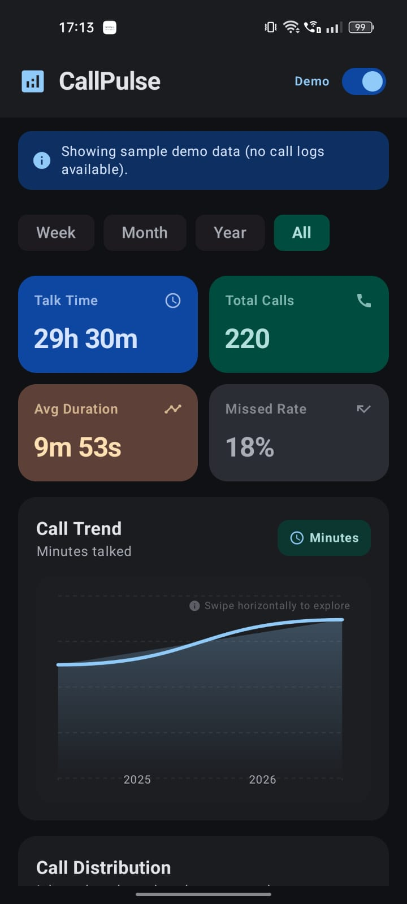
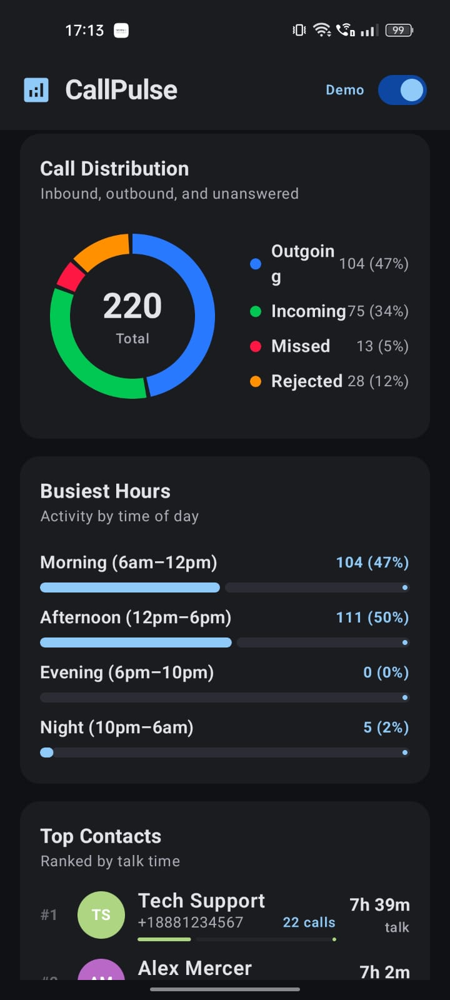

# CallPulse

A beautiful Android app for call log analytics — talk time, usage stats, frequent contacts, and trend visualizations.

View in AI Studio: https://ai.studio/apps/81452cd9-53bf-4ea4-a850-7516cf6d2c74

## Screenshots

| Dashboard & trends | Call distribution & busiest hours | Top contacts |
|:---:|:---:|:---:|
|  |  |  |

- **Dashboard** — Talk time, total calls, average duration, missed rate, and interactive call trends
- **Distribution** — Inbound / outbound / missed / rejected breakdown with busiest hours of day
- **Contacts** — Top contacts ranked by talk time

## Run Locally

**Prerequisites:** [Android Studio](https://developer.android.com/studio)

1. Open Android Studio
2. Select **Open** and choose the directory containing this project
3. Allow Android Studio to fix any incompatibilities as it imports the project
4. Create a file named `.env` in the project directory and set `GEMINI_API_KEY` in that file (see `.env.example`)
5. Remove this line from the app's `build.gradle.kts` file: `signingConfig = signingConfigs.getByName("debugConfig")`
6. Run the app on an emulator or physical device
